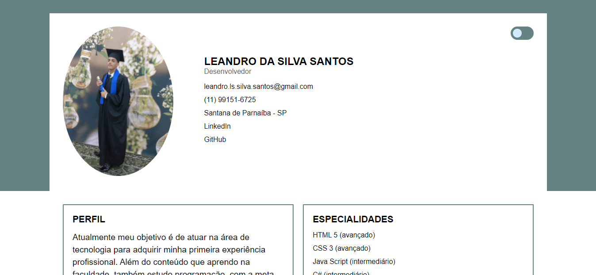
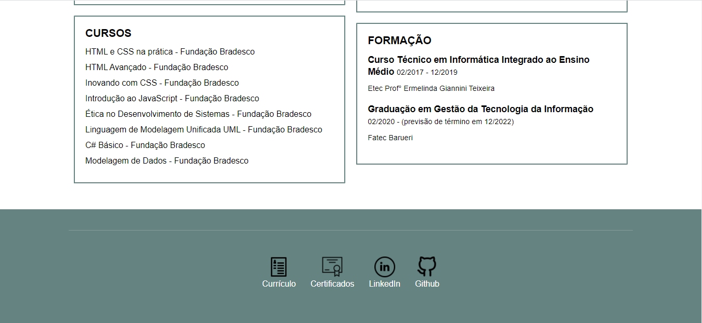
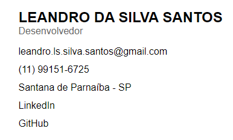
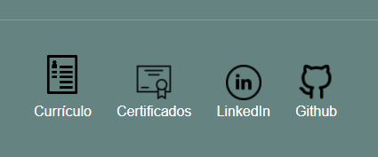

# Personal Portfolio
A single page with the author's personal and technical information, created along with a Kenzie HTML and CSS course

## Visuals

### Button DarkMode
When you click, the page gets a dark theme

### Links
Clicking the email takes you to your device's default email app to send an email, with the phone number almost the same. When you click on LinkedIn or GitHub, you will be taken to my account page.

### Icons
Hovering over icons zooms in, Curriculo and Certificados icons forward to a MediaFire download page.

## Status
Project completed

## Aplication demo
Link: https://leandro-silva-santos.github.io/

## License
[MIT](https://choosealicense.com/licenses/mit/)